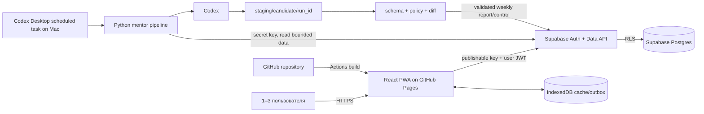
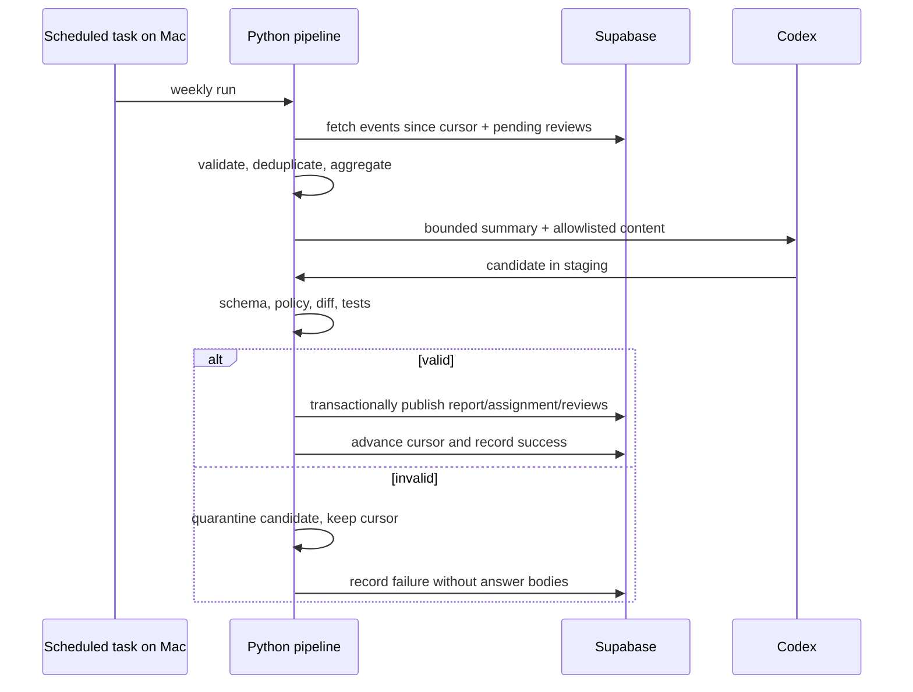

# Архитектура AI Mentor Web

Статус: Architecture Baseline 2.0  
Дата: 2026-08-18  
Решения: [ADR-002](docs/adr/ADR-002-web-pwa-github-pages-supabase.md), [ADR-003](docs/adr/ADR-003-self-service-named-signup.md), [ADR-004](docs/adr/ADR-004-versioned-course-releases-in-supabase.md)

## 1. Зафиксированные решения

1. **Web/PWA вместо native iOS.** Единственный пользовательский клиент — responsive SPA/PWA, оптимизированная для Safari на iPhone и desktop‑браузеров.
2. **GitHub Pages обслуживает только статику.** HTML, CSS, JavaScript, service worker и публичный учебный контент собираются GitHub Actions и публикуются на Pages.
3. **Supabase — backend MVP.** Используются Postgres, Auth и Data API на Free plan. Собственный постоянно работающий сервер отсутствует.
4. **Маленькая закрытая группа.** Система рассчитана на 1–3 пользователей. Они регистрируются по имени + паролю в короткое bootstrap-окно, после чего signup можно выключить.
5. **Браузер обращается к БД через RLS.** Frontend использует только publishable key и JWT пользователя. Каждая пользовательская таблица защищена Row Level Security.
6. **Append-only progress events.** Учебные действия записываются как неизменяемые события с уникальным `event_id`; повторная отправка идемпотентна.
7. **Локальный offline buffer.** IndexedDB хранит кэш контента, активную сессию и очередь неподтверждённых событий. Postgres остаётся источником истины после подтверждения sync.
8. **Codex запускается вне браузера.** Недельный pipeline выполняется локально на Mac через scheduled task или вручную, читает ограниченный набор данных и пишет candidate только в staging.
9. **Codex не публикует напрямую.** Candidate проходит JSON Schema, policy checks и review diff; только pipeline записывает валидный результат в Supabase.
10. **Provider portability.** Доменные таблицы используют обычный PostgreSQL и версионированные SQL migrations. Supabase‑специфичная логика ограничивается Auth/Data API/RLS adapter.
11. **Доступ из РФ проверяется до разработки.** На Sprint 0 обязательны реальные проверки GitHub Pages и Supabase с домашнего и мобильного подключения на iPhone. При нестабильности применяется fallback из документа выбора БД.

## 2. Контекст системы



## 3. Стек

### Web/PWA

| Область | Решение |
|---|---|
| Язык | TypeScript в strict mode |
| UI | React, функциональные компоненты |
| Сборка | Vite |
| Маршрутизация | Hash routing для надёжной работы под `/<repository>/` на GitHub Pages |
| Server state | TanStack Query или небольшой repository layer поверх `supabase-js` |
| Локальные данные | IndexedDB; wrapper выбирается в Sprint 1 после spike |
| PWA | Web App Manifest + service worker; cache-first для versioned assets, network-first для API |
| Стили | CSS variables + CSS Modules; mobile-first, без обязательного UI framework |
| Markdown | Sanitized renderer без raw HTML и произвольных URL schemes |
| Тесты | Vitest + Testing Library; Playwright для критического mobile flow |
| Качество | ESLint, Prettier, TypeScript typecheck |

### Backend/data

| Область | Решение |
|---|---|
| База | Supabase Postgres Free |
| Browser API | Supabase Data API через `supabase-js` |
| Auth | имя + пароль поверх Supabase email/password с внутренним техническим email |
| Авторизация | RLS: `auth.uid() = user_id`; admin access только локальному pipeline |
| Миграции | SQL в `database/migrations/`, последовательно и идемпотентно |
| Seed | только публичный учебный контент и synthetic users/fixtures |
| Backend logic | Postgres constraints/functions; Edge Function только если операцию нельзя безопасно выразить RLS/RPC |
| Backup MVP | недельный локальный export в `.mentor/backups/`, каталог игнорируется git |

### Mentor pipeline

| Область | Решение |
|---|---|
| Runtime | Python 3.12+ в `venv` |
| Модели | Pydantic 2 + JSON Schema |
| Контент | Markdown + YAML front matter / YAML |
| CLI | Typer + Rich |
| DB adapter | отдельный Supabase/Postgres adapter; secret key только из environment |
| Генерация | Codex scheduled task на Mac, недельный и ручной режим |
| Валидация | stable IDs, prerequisites, rubrics, time budget, diff, schema |
| Тесты | pytest + Ruff, fake DB/Codex adapters |

### Deployment

- GitHub Actions выполняет install, lint, typecheck, unit tests и production build.
- Pages получает только содержимое `apps/web/dist`.
- Production base path задаётся из имени репозитория; абсолютные ссылки на корень домена запрещены.
- Pull request не должен получать Supabase secret key. Frontend tests используют fake adapter или отдельный test project.
- Database migrations применяются вручную владельцем в MVP; автоматизация появляется только после теста backup/rollback.

## 4. Модули и границы

```text
ai_mentor_app/
├── apps/web/
│   ├── src/app/                 # composition, router, providers
│   ├── src/features/            # today, learn, practice, progress, settings
│   ├── src/domain/              # чистые TS reducers и policies
│   ├── src/data/                # Supabase/IndexedDB repositories
│   ├── src/ui/                  # доступные UI primitives
│   └── public/                  # manifest/icons/static assets
├── database/
│   ├── migrations/              # tables, indexes, constraints, RLS
│   ├── seed/                    # безопасный demo content
│   └── tests/                   # SQL/RLS acceptance cases
├── content/                     # авторские Markdown/YAML
├── schemas/                     # внешние JSON contracts
├── fixtures/                    # synthetic fixtures
└── tools/mentor_pipeline/       # weekly analysis/generation
```

### Frontend boundaries

- `domain` не импортирует React, Supabase или IndexedDB.
- `features` вызывают use cases/repositories и не выполняют SQL/HTTP напрямую.
- `data/supabase` реализует remote repository.
- `data/indexeddb` реализует cache/outbox и не является единственным источником прогресса.
- UI не вычисляет mastery и награды самостоятельно вне versioned domain reducer.

### Python boundaries

- `fetch`: получить профили, новые events и pending answers через read adapter;
- `aggregate`: вычислить evidence, слабые темы и bounded summary;
- `generate`: подготовить prompt/context и вызвать Codex;
- `validate`: проверить candidate, IDs, ссылки, rubrics и policy;
- `publish`: транзакционно записать report, assignment и reviews через write adapter;
- `backup`: экспортировать изменяемые пользовательские данные локально;
- `doctor`: проверить окружение, Codex и наличие DB settings без вывода секретов.

## 5. Данные

### Основные таблицы

| Таблица | Назначение | Ключевые поля |
|---|---|---|
| `profiles` | настройки ученика | `user_id`, goal, timezone, daily_minutes |
| `progress_events` | append-only факты обучения | `event_id`, `user_id`, item_id, type, payload, occurred_at |
| `card_states` | производное расписание повторений | `user_id`, card_id, due_at, stability, difficulty |
| `mastery_snapshots` | версионированный результат reducer | `user_id`, topic_id, score, algorithm_version |
| `pending_reviews` | свободные ответы для mentor-run | `id`, `user_id`, task_id, answer, status |
| `weekly_reports` | вывод недельного анализа | `id`, `user_id`, period, summary, weak_topics |
| `assignments` | контрольная/рекомендованный план | `id`, `user_id`, report_id, status, due_at |
| `reviews` | оценка свободного ответа | `id`, `user_id`, task_id, score, feedback |
| `pipeline_runs` | аудит генерации без секретов | `run_id`, status, input_cursor, error_code |

Учебные Topic/Lesson/Card/Task собираются из `content/` в проверенный snapshot. Опубликованный общий snapshot хранится в `course_releases` по ADR-004, а frontend build содержит ту же версию как offline fallback. Если персонализированный candidate изменяет или добавляет сущность, он сохраняет stable ID и версию.

### Progress event

```json
{
  "schema_version": 1,
  "event_id": "0198-example-uuid",
  "user_id": "auth-user-uuid",
  "profile_id": "default",
  "device_id": "browser-random-id",
  "item_id": "sql.window-functions.task-003",
  "event_type": "task_submitted",
  "occurred_at": "2026-08-18T08:42:11Z",
  "timezone": "Europe/Moscow",
  "payload": {
    "attempt": 1,
    "duration_seconds": 412,
    "hints_used": 0,
    "correct": false
  }
}
```

- `event_id` создаётся в браузере до отправки.
- Primary key предотвращает повторное применение.
- `user_id` на insert не принимается на доверии: RLS проверяет JWT, а policy/trigger фиксирует владельца.
- События не обновляются и не удаляются обычным пользователем.
- Свободный ответ хранится отдельно и не копируется в diagnostics/summary.

## 6. Auth и RLS

1. Владелец временно разрешает signup и отключает email confirmation.
2. До трёх пользователей регистрируются по уникальному имени и паролю; затем signup можно выключить.
3. После login браузер получает JWT.
4. На каждой пользовательской таблице включён RLS до выдачи frontend grants.
5. `select/insert/update` разрешаются только строкам текущего `auth.uid()` и только нужным операциям.
6. Для `progress_events` нет frontend `update/delete` policy.
7. Локальный pipeline использует secret key из environment; он не логирует key и не передаёт его Codex.
8. RLS acceptance tests запускаются минимум для Alice/Bob/anonymous/admin cases.

Publishable key нельзя считать паролем: он виден в JavaScript. Безопасность данных обеспечивает JWT + RLS. Secret/service-role key обходит RLS и никогда не включается в frontend build.

## 7. Offline и синхронизация

1. При запуске PWA загружает cached content и активную сессию из IndexedDB.
2. Пользовательское действие атомарно сохраняется в локальный outbox до изменения UI.
3. Sync отправляет события upsert/insert с idempotency по `event_id`.
4. После подтверждения сервера событие помечается delivered; локальная копия может храниться для UX, но не как единственный источник истины.
5. При конфликте одного `event_id` с другим payload sync останавливается с `EVENT_CONFLICT`.
6. Reports/assignments загружаются network-first и кэшируются после проверки schema version.
7. Logout очищает пользовательский IndexedDB cache данного профиля.

Service worker не кэширует auth responses и не хранит secret data в Cache Storage.

## 8. Недельный mentor pipeline



- Для каждого пользователя используется отдельный cursor.
- Повтор run с тем же входным диапазоном не создаёт второй report/assignment.
- Сбой после генерации, но до commit, безопасно повторяется.
- Если Mac выключен, данные не теряются; run выполняется вручную или в следующий доступный период.

## 9. Безопасность

- GitHub Pages и repository считаются публичными.
- Реальные `.env`, DB dumps, ответы и local backups не коммитятся.
- Markdown проходит sanitization; raw HTML, scripts и опасные URL schemes запрещены.
- Content Security Policy по возможности ограничивает `connect-src` GitHub Pages и конкретным Supabase project URL.
- Пользовательский SQL/Python хранится как текст и автоматически не исполняется.
- Secret key передаётся только DB adapter, но не Codex prompt.
- Логи содержат IDs, counts и error codes, но не полный текст ответов.
- Перед миграцией схемы выполняется export; Free plan не считается полноценным backup/SLA.

## 10. Наблюдаемость и восстановление

- UI показывает online/offline, pending event count и последнюю успешную sync.
- `pipeline_runs` хранит статус и cursor каждого mentor-run.
- Ошибки имеют стабильные коды: `AUTH_REQUIRED`, `NETWORK_UNAVAILABLE`, `RLS_DENIED`, `EVENT_CONFLICT`, `SCHEMA_UNSUPPORTED`, `PIPELINE_FAILED`.
- Раз в неделю создаётся локальный JSON export изменяемых таблиц в ignored каталоге.
- Восстановление тестируется импортом export в отдельный test project, а не только фактом создания файла.

## 11. Ограничения baseline

- GitHub Pages не выполняет Python или server-side code.
- Scheduled task с локальными файлами требует включённый Mac и запущенное desktop‑приложение.
- Supabase Free может приостанавливать неактивный project и не даёт production SLA/полноценного backup.
- Доступ зарубежных сервисов из РФ может меняться; connectivity test является release gate, а не одноразовым предположением.
- До 3 пользователей и небольшой объём событий не требуют собственного backend server.
